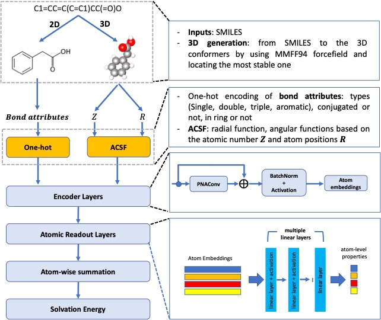

<h1 align="center">Accurate prediction of aqueous free solvation energies using 3D atomic feature-based graph neural network with transfer learning</h1>
<h4 align="center">Dongdong Zhang, Song Xia, and Yingkai Zhang</h4>

The repository contains all of the code and instructions needed to reproduce the experiments and results of **[Accurate prediction of aqueous free solvation energies using 3D atomic feature-based graph neural network with transfer learning]**. We show the whole process from datasets to model training step-by-step.

## Table of Contents
- Conda environment setup  
- Datasets downloading   
- Data preprocessing  
- Training  
---

## 1. Conda environment setup: 
Python 3.8 is recommended here with the **[miniconda3](https://docs.conda.io/en/latest/miniconda.html)**. 
The package installation order is recommended as below: 
- PyTorch. 
`conda install pytorch cudatoolkit=10.2 -c pytorch`
To be noted, in order to be compatible with the installation of Torch-geometric, cuda10.2 for torch should be used here. 
- **[Torch geometirc](https://github.com/pyg-team/pytorch_geometric)**.  

`conda install pyg -c pyg`

- **[rdkit](https://www.rdkit.org/docs/Install.html)**.  

`conda install -c conda-forge rdkit`

- **[DSCRIBE](https://singroup.github.io/dscribe/latest/install.html)**.  

`conda install -c conda-forge dscribe`

- PrettyTable.  

`conda install -c conda-forge prettytable`

## 2. Datasets downloading
Since the 3D structures are stored in SDF and XYZ formats for Frag20-Aqsol-100K, they are saved elsewhere and can be downloaded either from our IMA website or using the following command line. 
- To download and save SDF files for MMFF-optimized geometries: 

> `cd ./data/Frag20-Aqsol-100K/sdf/MMFF/`  (navigate to the corresponding directory)  
> `wget link` (link can be copied from IMA)  

- To download XYZ files for MMFF-optimized geometries:   

> `cd ./data/Frag20-Aqsol-100K/xyz/MMFF/`  (navigate to the corresponding directory)  
> `wget link` (link can be copied from IMA)  

- To download SDF files for QM-optimized geometries:  

> `cd ./data/Frag20-Aqsol-100K/sdf/QM/`  (navigate to the corresponding directory)  
> `wget link` (link can be copied from IMA)  

- To download XYZ files for QM-optimized geometries:  

> `cd ./data/Frag20-Aqsol-100K/xyz/QM/`  (navigate to the corresponding directory)  
> `wget link` (link can be copied from IMA)  

After downloading the tar.bz2 file, unzip it using `tar -xf`. You should see a list of folders as shown below, for example, in the directory `./data/Frag20-Aqsol-100K/sdf/MMFF/`: 

Check the total number files: `find .-type f | wc -l`, which should return 100000 (except the tar.bz2 file).

## 3. Data preprocessing
To generate molecule graph datasets for Torch geometric reading, the `preprae_data.py` contains the codes for Frag20-Aqsol-100K and FreeSolv. For example, the following command line is used to process each molecule in Frag20-Aqsol-100K by featurizing atoms/bonds using 3D atomic features.   

`python prepare_data.py  --data_path <path> --save_path <save_path> --dataset Frag20-Aqsol-100K --ACSF --cutoff 6.0 --xyz MMFF --train_type TS`  

where `<path>` is the path to the place where folders sdf, xyz and split are all saved, `<save_path>` is the same path as `data_path` for default where a new directory `graphs` will be created. `--ACSF` means the 3D features are used here. `--cutoff` is the parameter for ACSF functions. `--xyz` means if the MMFF-optimized or QM-optimized geometries are used. `--train_type` means if we save the graph datasets to train the model from scratch (TS) or not. 

## 4. Training